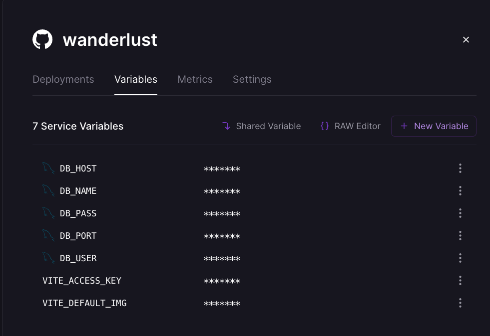
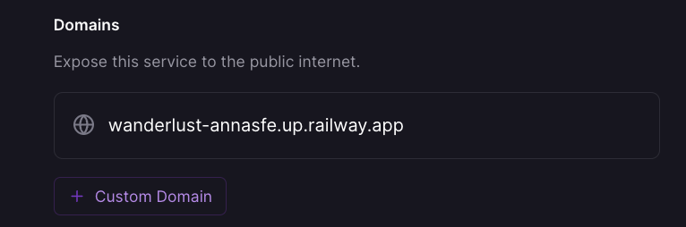

# FLASH - Deploy to Railway

## Login to Railway (using your Github account)

- Choose "New Project" and then "Deploy from Github repo" (need to give it permission). Select the right branch (main, production etc). Click on "Deploy Now".

- Create MySQL instance clicking on "New" and then choosing "Database" and "Add MySQL".

- Once MySQL is created (it should be empty with no tables at this point) you must import MySQL Env variables into the project instance (click on your project and then Settings -> Variables -> New Variable) and add them one by one, renaming them to the names you are using in your code (the ones you had defined in your .env file), for example MYSQLUSER should become DB_USER, etc. You don't need the MYSQL_URL variable.
  

- Add also any other env variables you have on your code, both front and back (SUPERSECRET, VITE_API_KEYS etc.).

## back to your VSCode...

- You will need to install and use `mysql2` instead of `mysql` to avoid some authentication issues with the mysql server of Railway. For this,

  - install `mysql2` and import `mysql2` instead of `mysql` on the database.js and helper.js files of your model folder
  - modify helper.js file, adding the following after line 55 (after the second `else if`)

    ```js
        else {
            //for mysql2 results data structure
            result.forEach(row => results.data.push(row));
            }
    ```

  - add also the DB_PORT to both files, where the rest of the db info (localhost, user, password etc.) is used

    ```js
    port: process.env.DB_PORT || "3306";
    ```

- Add build command to the main (backend) `package.json`:

  ```bash
  "build": "cd client && npm install && npm run build"
  ```

- Double check you have the following code in your `app.js` so that your server can serve all the static assets (the build version of your front-end):

  ```js
  // Serve static files from the React frontend app
  app.use(express.static(path.join(__dirname, "/client/dist")));

  // your API routes here...
  // app.use("/api/users", usersRouter);

  // Anything that doesn't match the above, send back index.html
  app.get("*", (req, res) => {
    res.sendFile(path.join(__dirname + "/client/dist/index.html"));
  });
  ```

## Back to Railway project Settings tab...

- Add a domain for your project



- Set start command to `npm run migrate && npm start`


- Set build command to `npm run build`

- You are done!
